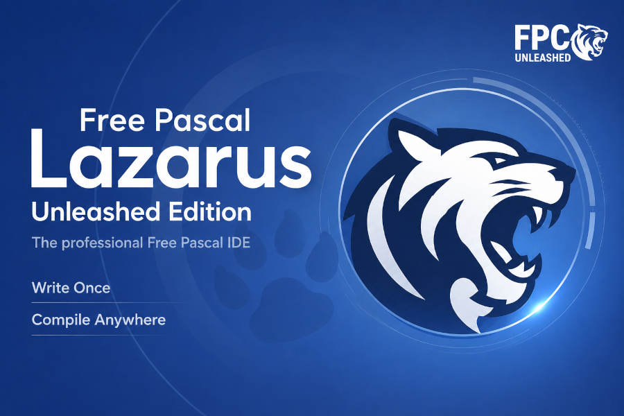

# Lazarus Unleashed Edition

**Lazarus Unleashed** is a community-driven fork of **Lazarus IDE** built specifically for [FPC Unleashed](https://github.com/fpc-unleashed/freepascal). Stock Lazarus has no idea about Unleashed mode features - it underlines `match`, `defer`, contextual `step`, inline `var ... := ...`, and the rest as syntax errors, and code completion stops working the moment you cross into anything Unleashed adds. This fork makes the IDE understand the language as it actually compiles.

It also ships with an Unleashed-aware default project template (new units start in `{$mode unleashed}`) and visible branding so you do not accidentally launch a stock Lazarus and wonder why your code stops getting highlighted.

 

## What's different from stock Lazarus

- Syntax highlighting for `match`, `defer`, contextual `step`, FAM `count`, inline `var ... := ...` declarations, `^T` pointers in inline-var, and other Unleashed keywords/constructs.
- Codetools parses inline `var`, `autofree`, `with`-block bindings, multi-line strings, statement expressions, anonymous tuples, and scoped cleanup. Auto-complete works on all of them.
- New project templates emit `{$mode unleashed}` by default. Form units inherit the mode from their parent package.
- Splash, About dialog, window title, and menus say "Lazarus Unleashed Edition" - so you can have stock Lazarus and Unleashed side-by-side without confusion.

## Installation

Lazarus Unleashed only builds against [FPC Unleashed](https://github.com/fpc-unleashed/freepascal) - install both together. The full procedure is in the [**FPC Unleashed README**](https://github.com/fpc-unleashed/freepascal#installation).
